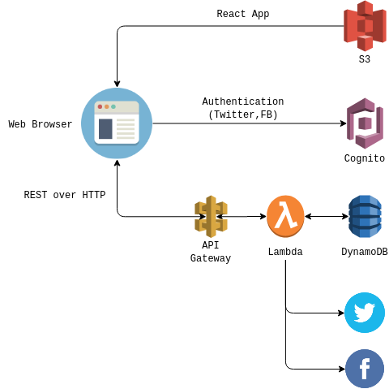

# eskrm_hakbang
Hakbang is an online information tracking and dissimination platform and is part of Project Eskrima.

## Serverless Architecture


## API

### Sample GET response body

```
{
  "confirmedCases": 9,
  "death": 2,
  "pui":{
    "homeQuarantine": 9,
    "admitted": 9,
    "dischargedAfterNegativeConfirmTest": 0,
    "cleared": 10,
    "assconded": 0,
    "diedPositive": 2,
    "diedNegative": 1,
    "diedProbable": 1,
    "totalReported": 32
  },
  "labFindings":{
    "positive": 9,
    "negative": 11,
    "pending": 5,
    "reclassified": 7
  },
  "pum":{
    "onGoing": 222,
    "completed": 84,
    "total": 306
  }
}
```